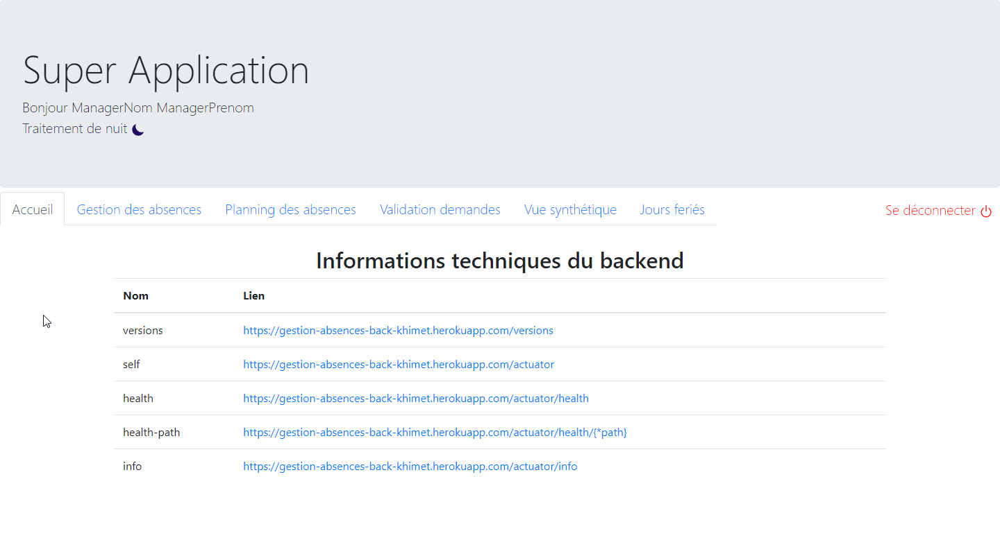

[](https://opensource.org/licenses/MIT) [](https://travis-ci.com/Khimet/gestion-des-absences-front)

# Gestion des Absences - GDA

*Gestion des Absences* est une application web développée avec Spring et Angular par [Robin-lad](https://github.com/Robin-lad), [sanaeltahhan](https://github.com/sanaeltahhan), [Vokan](https://github.com/Vokan) et moi-même (Khimet). Ce projet a été développé en mode scrum sur un sprint de 12 jours.

[1. Présentation](#présentation)  
[2. Captures d'écrans - démo](#capture-décrans---démo)  
[3. Utiliser l'application](#utiliser-lapplication)

## Présentation

Il s'agit d'une application qui a pour but de gérer les absences des employés d'une entreprise. Son utilisation met en jeu plusieurs rôles utilisateurs:

- Rôle employé: Crée une demande d'absences et la soumet à validation.
- Rôle manager: S'occupe de la validation des demandes.
- Rôle administrateur: Crée et gère les jours fériés et les RTT employeur de l'entreprise.

L'utilisation de cette application suit le processus suivant:

Tous utilisateurs est en mesure via cette application de faire une demande d'absence et de pouvoir gérer ces demandes via le processus suivant:

**1. Ajout/Création**

Les employés peuvent donc ajouter/créer une demande d'absence. L'administrateur peut ajouter/créer un jour férié ou un RTT employeur durant lesquels les employés ne travailleront pas et/ou l'entreprise sera fermée.

**2. Visualisation**

Chaque utilisateur dispose d'éléments de visualisations sous la forme de tableaux ou de graphiques de type histogramme.
L'employé visualise ses demandes d'absences sur un tableau et un calendrier sur lesquels sont representés ses absences. Il a accès également à la liste des jours fériés et des RTT employeurs définis par l'administrateur.
Le Manager possède plusieurs vues synthétiques lui permettant de visualiser les demandes d'absences des employés et va pouvoir décider de valider ou refuser les demandes.
L'administrateur quant à lui peut visualiser les jours fériés et RTT employeurs qu'il a crée.

**3. Modification**

Si la demande d'absence a été rejetée par le manager chaque employé va pouvoir revenir sur sa demande d'absence et la modifier. 
L'administrateur peut également modifier les jours fériés et RTT employeur qu'il a crée.

**4. Suppression**

Chaque employé a la possibilité de supprimer les absences qu'il a demandé. L'administrateur a également la possibilité de supprimer les jours fériés et RTT employeur qu'il a préalablement crée.

Au travers de cette application toute demande d'absence possède un cycle de vie où chaque demande va passer par des statuts différents: *INITIAL*, *EN_ATTENTE_DE_VALIDATION*, *VALIDE*, *REJETE*.

 

Lorsque une demande d'absence vient d'être faite par un employé celle-ci a un statut INITIAL.

Un traitement automatique de nuit a été implémenté dans le processus, il a pour but de mettre à jour le statut des demandes d'absences et de mettre à jour le compteur du nombre de congés payés et de RTT attribué à l'employé par année. En loccurence dans cette application chaque employé a droit à 25 jours de congés payés et 11 jours de RTT par an. 

Ce traitement de nuit change le statuts des demandes d'absences qui ont le statut INITIAL pour le statut EN_ATTENTE_DE_VALIDATION et décrémente d'un jour le compteur. 

Le manager pourra par la suite décider de passer la demande au statut VALIDE ou au statut REJETE. Si la demande est rejetée par le compteur des absences est réincrémenté d'un jour.

## Capture d'écrans - Démo

Voici les captures d'écrans de l'application pour les différents rôles utilisateurs: Employé, Manager et Administrateur.

### Page de connexion


### Employé

#### Création d'une demande d'absence


#### Visualisation des absences et des jours fériés


#### Modification et suppression d'une absence


### Traitement de nuit


### Manager

#### Validation et visualisation des absences



### Administrateur

#### Création/Ajout d'un jour férié et/ou un RTT employeur


## Utiliser l'application

### En ligne

L'application est déployée en ligne, cliquer [ici](https://khimet.github.io/gestion-des-absences-front) pour y accéder.

**Il se peut que l'application prenne du temps à démarrer, veuillez patienter 5 minutes le temps que GitHub Pages et Heroku se réveillent de leur période d'inactivité.**

*Attention ! Pour des raisons que j'ignore pour le moment, l'application ne marche pas avec les navigateurs Chrome et Opera, je travaillerai prochainement dessus pour résoudre ce problème de compatibilité. En attendant veuillez utiliser les navigateurs Firefox ou Microsoft Edge.*

### En local

#### Front

* Récupérer les dépendances :

```
npm install
```

* Démarrer le projet :

```
npm start
```

#### Back

* Démarrer le projet [backend](https://github.com/Khimet/gestion-des-absences-back):

```
mvn spring-boot:run
```

* Ouvrez votre navigateur web à l'adresse : [http://localhost:4200](http://localhost:4200)


